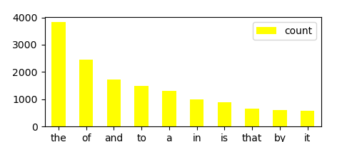
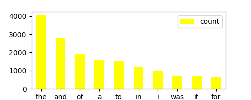
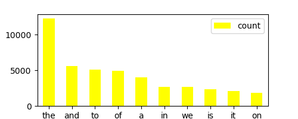
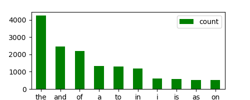

```{r setup, include=FALSE}
knitr::opts_chunk$set(echo = TRUE)
knitr::opts_knit$set(root.dir = here::here())
```

## The most frequent words in the 4 novels we studied:

Isles:


Abyss:


Last:


Sierra:
